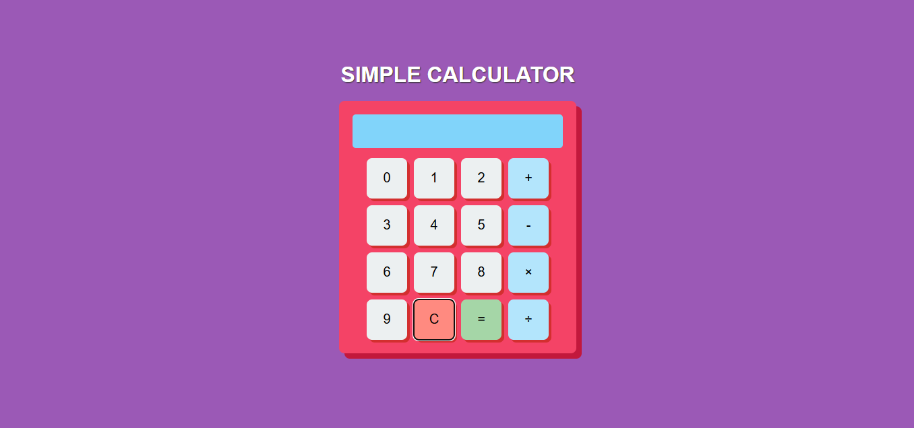

# 🧮 Responsive Calculator – Single HTML File

A responsive, mobile-friendly calculator built entirely in a single HTML file using internal CSS and JavaScript. This project is designed for beginners to demonstrate DOM manipulation, event handling, and responsive layout — all without external files.

---

## 🚀 Features

- Basic arithmetic operations: Addition, Subtraction, Multiplication, Division
- Responsive layout for desktop and mobile devices
- Designed using internal CSS for styling
- Pure JavaScript logic for real-time calculations
- Lightweight and fast — no external dependencies

---

## 📁 Project Structure

responsive-calculator/
└── responsivecalc.html

> 💡 All logic (JavaScript) and styling (CSS) are written within `responsivecalc.html` using `<script>` and `<style>` tags respectively.

---

## 🛠 Technologies Used

- HTML5
- CSS (internal using `<style>`)
- JavaScript (internal using `<script>`)

---

## 📷 Preview

-

## 📌 How to Use

1. Clone or download this repository
2. Open the file `responsivecalc.html` in any modern browser
3. Use the calculator on desktop or mobile

---

## 👩‍💻 Author

**S. Misha**  
Aspiring Full Stack Developer | BBA Graduate  
[GitHub Profile](https://github.com/Mi-Isha16)
